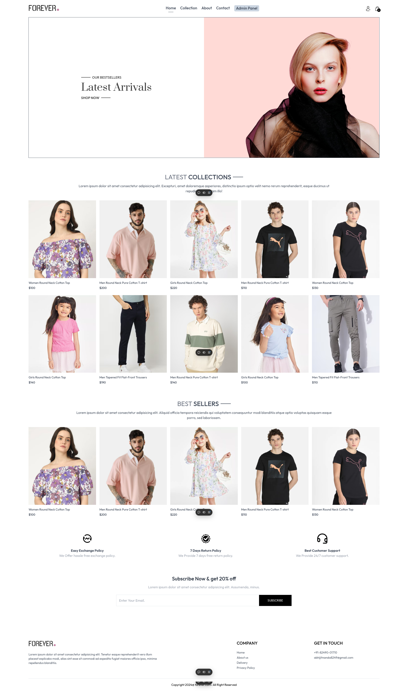
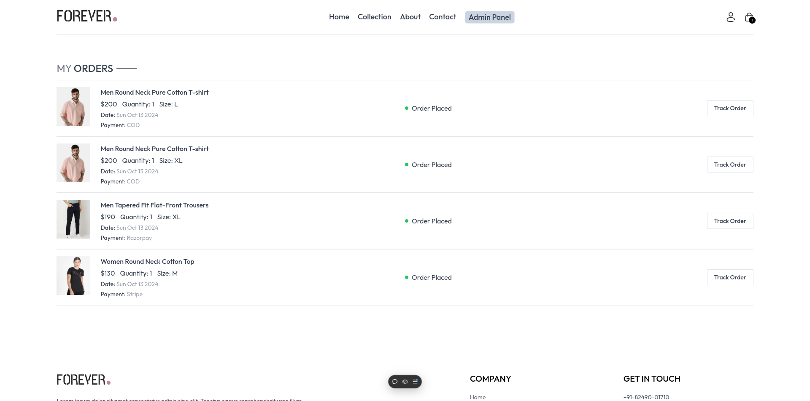
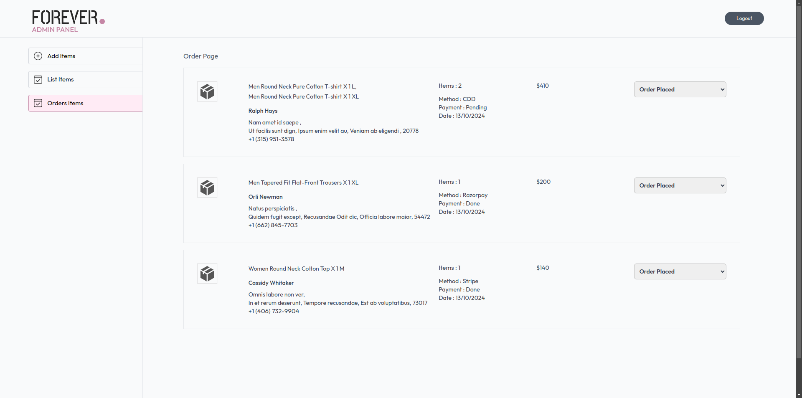

# Forever-Ecommerce

A full-featured MERN stack eCommerce application with secure OTP authentication, product size-wise stock management, order email notifications, and a complete admin dashboard.

---

# 🚀 New Features Added

## 🔐 Email OTP Verification (Register & Login)

- OTP sent to user email at **registration** for account verification  
- OTP sent again during **login** for secure authentication  
- OTP expires after a few minutes  
- **Resend OTP** appears after a 60-second timer  
- User cannot log in without verifying email  

---

## ✉ Order Email Notifications

After a successful order:

- The **user receives an order confirmation mail**
- The **admin receives a new order notification mail**

Emails include:
- Order items  
- Quantities  
- Prices  
- Payment method  
- Shipping address  

---

## 📦 Product Size & Stock Management

Admin can add sizes (S, M, L, XL etc.) with individual stock.

User Side Features:
- If size stock < 5 → **Red low-stock warning**
- If size stock = 0 → **Size disabled**
- User cannot cart more quantity than available stock
- During ordering, backend also checks stock to prevent overselling

---

# 📸 Screenshots

## User Features

### 🔐 Login & Register


---

### 🏠 Homepage



---

### 🛍 Collection Page


---

### ℹ About Page


---

### ☎ Contact Page


---

### 🛒 Cart Page


---

### 💳 Payment Page


---

### 📦 Orders Page



---

# 🛠 Admin Features

### 🔐 Admin Login


---

### ➕ Add Product (with sizes & stock)


---

### 📦 All Products


---

### 🧾 All Orders



---

# ⚙ Backend Packages Used

| Package | Purpose |
|--------|---------|
| **cors** | Allow frontend to access backend |
| **dotenv** | Environment variables |
| **express** | Create REST APIs |
| **jsonwebtoken** | JWT auth system |
| **mongoose** | MongoDB connection |
| **multer** | Upload images |
| **nodemon** | Auto restart on backend changes |
| **razorpay** | Payment gateway |
| **stripe** | Payment gateway |
| **validator** | Validate email & password |
| **cloudinary** | Image hosting |
| **bcrypt** | Encrypt passwords |
| **nodemailer** | Send OTP emails & order emails |

---

# 🧑‍💻 How to Run This Project

## 1️⃣ Clone the Repository
```bash
git clone git@github.com:abhi051002/Forever-Ecommerce-FullStack.git
```

## 2️⃣ Go to Project Directory
```
cd Forever-Ecommerce-FullStack
```
## 3️⃣ Install Frontend Dependencies
```
cd frontend
npm install
```
## 4️⃣ Install Admin Dependencies
```
cd admin
npm install
```
## 5️⃣ Install Backend Dependencies
```
cd backend
npm install
```
---
# 🔧 Environment Setup
Copy `.env.example` → `.env`
```
cp .env.example .env
```
and fill values:

```
MONGO_URI=your_mongo_uri
JWT_SECRET=your_secret_key

# SMTP Credentials
SMTP_HOST=smtp.gmail.com
SMTP_PORT=587
SMTP_USER=your_email@gmail.com
SMTP_PASS=your_app_password

# Payment Keys
STRIPE_SECRET=xxxx
RAZORPAY_KEY_ID=xxxx
RAZORPAY_KEY_SECRET=xxxx

```

----

# ▶ Start Application
## Start Backend
```
cd backend
npm run server
```

## Start User Frontend
```
cd frontend
npm run dev
```

## Start Admin Panel
```
cd admin
npm run dev
```

---
# ⭐ Support

If you found this project helpful, please ⭐ star the repository!

Thank you for visiting Forever-Ecommerce! ❤️

---

If you want, I can also:

✅ Add badges (Made with React, Node, MongoDB, etc.)  
✅ Add GIF demo preview  
✅ Add API documentation section  
Just tell me!

If you face any issues or have suggestions, feel free to mail us at  
👉 **[abhijitnanda8249@gmail.com](mailto:abhijitnanda8249@gmail.com)**

