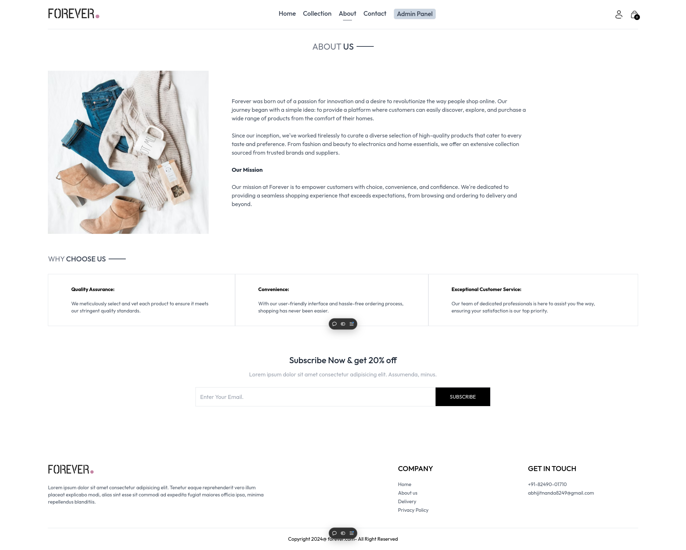
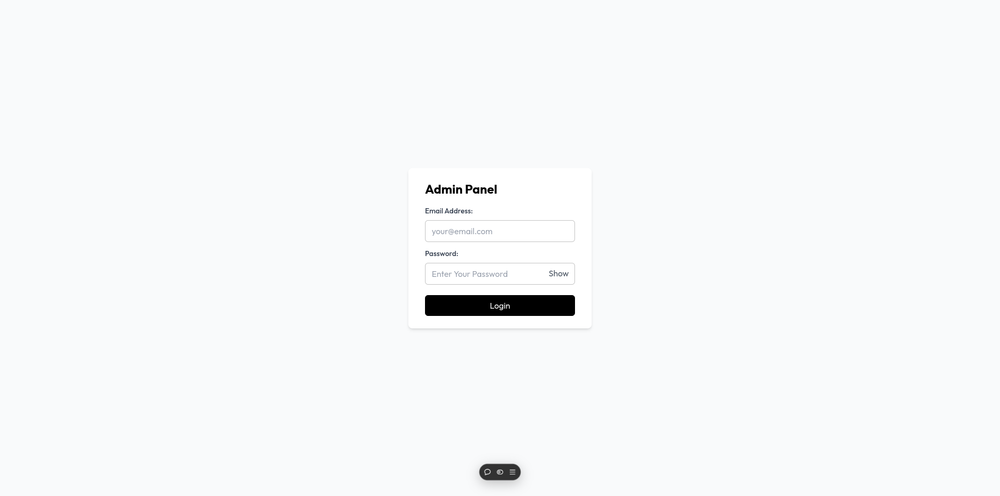

# Forever-Ecommerce

## Here I'm providing some screenshots of my website

## User Feature

### Homepage of Forever Ecommerce

- Here Some of Our Best Sellers Products and Latest Collections are Listed.
- User Can click on any product to see about more details about that product.


### Collection Page

- Here All Of Our Products and Collections are available.
- User Can click on any product to see about more details about that product.
- User Can filter products by category and sub-category and also filter by low to high price and vice versa.


### About Page

- This Page Contain Information about our missions , our product quality and Why you Choose us!!



### Contact Page

- Here You can find our contact information and contact on any queries.


### Login & Register Form

- Here user can login by providing the Login Credentials belongs to that user.
- User is validating here by JWT tokens.


- Here if you are new to our website then you can register youself with unique email-id.
- Here also user is validated by JWT tokens.


### Cart Page

- A Logged in User Can add Items to Cart by selecting the product and its sizes.
- User can see all his cart items by clicking on the Cart Icon which is on the righ top handside.


### Payment Page

- After Selecting All our favourite Products to the Cart you can visit the Cart Page and Proceed to Payments.
- Here you can purchase products with a choice of 3 different pay options
  - COD (Cash On Delivery)
  - Stripe
  - Razorpay


### Orders Page

- After The Successful Payment You can view all you order by clicking the Profile Icon > Order.
- All of your Orders are listed here you can track these orders.


## Admin Features

### Admin Login

- Here Admin can login by providing the Login Credentials belongs to that admin.
- Admin is validating here by JWT tokens.



### Add Products

- Admin have the rights to add products so that user can buy them.
- Admin can share the various angle pictures of the products.
- Admin can Fill the product form and add the products.


### All Products

- Here in List Items admin can see all products present in our website.
- Admin can delete any product if that does not exist anymore.


### All Orders

- Here Admin can access all orders that placed from different users.
- Admin can change the status of the order from here.


# How to run this Website

## First Time Installation Only

1. Clone this repository

  ```
  git clone git@github.com:abhi051002/Forever-Ecommerce-FullStack.git
  ```

2. Then Go to the Project directory

  ```
  cd Forever-Ecommerce-FullStack
  ```

3. Go To frontend and install all dependencies

  ```
  cd frontend/
  npm i
  ```

4. Go To admin and install all dependencies

  ```
  cd admin/
  npm i
  ```

5. Go To backend and install all dependencies
  ```
  cd backend/
  npm i
  ```

6. Then Copy all folder .env.example to .env
7. Get All the Required .env values
8. Then Start the application

** Don't Forgot to star the Repository **
